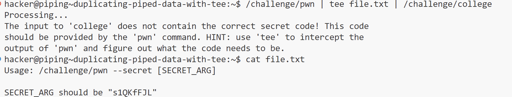

# PWN

## **1、Linux Luminarium**

### **Practicing Piping**

8、 grepping errors

知识点：

```jsx
# 通过2>$ 1的方式将error输出到标准输出
/challenge/run 2>&1 | grep pwn

#注意是&符号而不是$

# grep的用法

grep [pattern] [filepath]
grep X ./x.txt
```

9、duplicating piped data with tee

知识点：

tee命令的作用：tee命令可以将标准输入的内容导入到标准输出以及多个文件中

```jsx
/challenge/pwn | tee hint.txt | /challenge/college
```



随后按照提示的用法，将pwn命令的输出导入给college即可得到flag

11、split piping stderr and stdout

```jsx
/challenge/hack 2> >(/challenge/the) | /challenge/planet 
/challenge/hack 2> >(/challenge/the) > >(/challenge/planet)
/challenge/hack 2> >(/challenge/the) 1> >(/challenge/planet)
```

分流输出stderr与stdout。

1. `2> >(...)`：将 stderr（文件描述符 2）重定向到一个子shell，子shell 中运行 `/challenge/the` 命令。
2. `> >(...)`：将 stdout（文件描述符 1）重定向到一个子shell，子shell 中运行 `/challenge/planet` 命令。

**`> >()` 和`|` 的区别**

- **`> >()`**：
    - 会创建子shell 来处理重定向，可能会稍微影响性能，但在大多数情况下差异不大。
    - 适用于需要灵活处理多个输出流的复杂场景。
- **`|`**：
    - 直接在当前 shell 中处理，性能较高。
    - 适用于简单的命令链式调用。

### **Shell Variables**

这一部分的关卡都很简单

总结一部分知识点

```jsx
# 设置变量，这样设置的变量仅对当前shell可见
VAR=value

# 使用export设置变量，这样设置的变量对当前shell及其子shell都可见
export VAR=value

# 可以使用echo和env查看设置的变量
echo $VAR
env

# 使用$()获取命令的输出
VAR = $(cat file)

# 使用read读取输入
read VAR

# 使用read读取文件

read VAR < file
```

### **Processes and Jobs**

知识点总结

```go
Ctrl+Z 暂停
fg 启用并转到foreground
bg 启用并转到background

运行一条命令后，可以使用 echo $? 查看exit code
```

### **Perceiving Permissions**

```go
chown 改变文件归属
chgrp 改变文件归属组
chmod u/g/o/a +/-/= rwx [file]
chmod u/g/o/a=- [file]直接清除权限
chmod u+s [file] 让其他用户以该文件的owner权限接触该文件

```

## **2、computing 101**

### Your first program

```go
# 这一部分主要讲述了汇编代码的编写应用

汇编程序保存至.s文件中
使用syscall进行系统调用，系统调用编码保存在rax中
如：
mov rax, 60
syscall
调用60号系统调用exit

使用寄存器进行传参，如exit的参数保存在rdi中
mov rdi, 42
mov rax, 60
syscall

# 编译为可执行文件
编译前在文件头部加上
.intel_syntax noprefix 告知使用的是Intel汇编编码格式

as -o asm.o assemble.s
ld -o exe asm.o

# write syscall
syscall 编号为1
三个参数
rdi 要写入的文件描述符
rsi 字符串起始地址
rdx 字符串长度

```

### **Debugging Refresher**

set disassembly-flavor intel 设置为intel格式

level8

win+12 +20 +24 +33处，[rax]指向的地址为0，为nullptr，会引发segmentation fault

因而此处直接跳过错误代码，跳转到win+35进行后续操作即可

```go
   0x580e06449951 <win>:        endbr64 
   0x580e06449955 <win+4>:      push   rbp
   0x580e06449956 <win+5>:      mov    rbp,rsp
   0x580e06449959 <win+8>:      sub    rsp,0x10
   0x580e0644995d <win+12>:     mov    QWORD PTR [rbp-0x8],0x0
   0x580e06449965 <win+20>:     mov    rax,QWORD PTR [rbp-0x8]
   0x580e06449969 <win+24>:     mov    eax,DWORD PTR [rax]
   0x580e0644996b <win+26>:     lea    edx,[rax+0x1]
   0x580e0644996e <win+29>:     mov    rax,QWORD PTR [rbp-0x8]
   0x580e06449972 <win+33>:     mov    DWORD PTR [rax],edx
   0x580e06449974 <win+35>:     lea    rdi,[rip+0x73e]        # 0x580e0644a0b9
   0x580e0644997b <win+42>:     call   0x580e06449180 <puts@plt>
   0x580e06449980 <win+47>:     mov    esi,0x0
   0x580e06449985 <win+52>:     lea    rdi,[rip+0x749]        # 0x580e0644a0d5
   0x580e0644998c <win+59>:     mov    eax,0x0
   0x580e06449991 <win+64>:     call   0x580e06449240 <open@plt>
   
   jump *win+35
   c
```