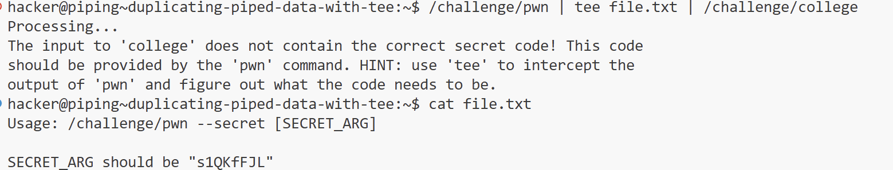

# PWN Getting Started

## **1、Linux Luminarium**

### **Practicing Piping**

#### Level8  grepping errors

知识点：

```
# 通过2>$ 1的方式将error输出到标准输出
/challenge/run 2>&1 | grep pwn

#注意是&符号而不是$

# grep的用法

grep [pattern] [filepath]
grep X ./x.txt
```

#### Level9  duplicating piped data with tee

知识点：

tee命令的作用：tee命令可以将标准输入的内容导入到标准输出以及多个文件中

```shell
/challenge/pwn | tee hint.txt | /challenge/college
```



随后按照提示的用法，将pwn命令的输出导入给college即可得到flag

#### Level11 split piping stderr and stdout

```shell
/challenge/hack 2> >(/challenge/the) | /challenge/planet 
/challenge/hack 2> >(/challenge/the) > >(/challenge/planet)
/challenge/hack 2> >(/challenge/the) 1> >(/challenge/planet)
```

分流输出stderr与stdout。

1. `2> >(...)`：将 stderr（文件描述符 2）重定向到一个子shell，子shell 中运行 `/challenge/the` 命令。
2. `> >(...)`：将 stdout（文件描述符 1）重定向到一个子shell，子shell 中运行 `/challenge/planet` 命令。

**`> >()` 和`|` 的区别**

- **`> >()`**：
    - 会创建子shell 来处理重定向，可能会稍微影响性能，但在大多数情况下差异不大。
    - 适用于需要灵活处理多个输出流的复杂场景。
- **`|`**：
    - 直接在当前 shell 中处理，性能较高。
    - 适用于简单的命令链式调用。

### **Shell Variables**

这一部分的关卡都很简单

总结一部分知识点

```shell
# 设置变量，这样设置的变量仅对当前shell可见
VAR=value

# 使用export设置变量，这样设置的变量对当前shell及其子shell都可见
export VAR=value

# 可以使用echo和env查看设置的变量
echo $VAR
env

# 使用$()获取命令的输出
VAR = $(cat file)

# 使用read读取输入
read VAR

# 使用read读取文件

read VAR < file
```

### **Processes and Jobs**

知识点总结

```
Ctrl+Z 暂停
fg 启用并转到foreground
bg 启用并转到background

运行一条命令后，可以使用 echo $? 查看exit code
```

### **Perceiving Permissions**

```
chown 改变文件归属
chgrp 改变文件归属组
chmod u/g/o/a +/-/= rwx [file]
chmod u/g/o/a=- [file]直接清除权限
chmod u+s [file] 让其他用户以该文件的owner权限接触该文件

```

## **2、computing 101**

### Your first program

```asm
# 这一部分主要讲述了汇编代码的编写应用

汇编程序保存至.s文件中
使用syscall进行系统调用，系统调用编码保存在rax中
如：
mov rax, 60
syscall
调用60号系统调用exit

使用寄存器进行传参，如exit的参数保存在rdi中
mov rdi, 42
mov rax, 60
syscall

# 编译为可执行文件
编译前在文件头部加上
.intel_syntax noprefix 告知使用的是Intel汇编编码格式

as -o asm.o assemble.s
ld -o exe asm.o

# write syscall
syscall 编号为1
三个参数
rdi 要写入的文件描述符
rsi 字符串起始地址
rdx 字符串长度

```

### **Debugging Refresher**

set disassembly-flavor intel 设置为intel格式

**level8**

win+12 +20 +24 +33处，[rax]指向的地址为0，为nullptr，会引发segmentation fault

因而此处直接跳过错误代码，跳转到win+35进行后续操作即可

```
   0x580e06449951 <win>:        endbr64 
   0x580e06449955 <win+4>:      push   rbp
   0x580e06449956 <win+5>:      mov    rbp,rsp
   0x580e06449959 <win+8>:      sub    rsp,0x10
   0x580e0644995d <win+12>:     mov    QWORD PTR [rbp-0x8],0x0
   0x580e06449965 <win+20>:     mov    rax,QWORD PTR [rbp-0x8]
   0x580e06449969 <win+24>:     mov    eax,DWORD PTR [rax]
   0x580e0644996b <win+26>:     lea    edx,[rax+0x1]
   0x580e0644996e <win+29>:     mov    rax,QWORD PTR [rbp-0x8]
   0x580e06449972 <win+33>:     mov    DWORD PTR [rax],edx
   0x580e06449974 <win+35>:     lea    rdi,[rip+0x73e]        # 0x580e0644a0b9
   0x580e0644997b <win+42>:     call   0x580e06449180 <puts@plt>
   0x580e06449980 <win+47>:     mov    esi,0x0
   0x580e06449985 <win+52>:     lea    rdi,[rip+0x749]        # 0x580e0644a0d5
   0x580e0644998c <win+59>:     mov    eax,0x0
   0x580e06449991 <win+64>:     call   0x580e06449240 <open@plt>
   
   jump *win+35
   c
```

### **Building a Web Server**

正好借这一部分复习一下汇编的知识。这一章一方面是要经常查表，查看各个[系统调用](https://www.cnblogs.com/tcctw/p/11450449.html)的用法，另一方面就是考察一些程序设计基本功。题目要求写一个处理GET请求和POST请求的汇编程序。

#### PART1

创建`socket`，以及执行`listen`，`bind`等系统调用，完成一个初始化。调用`bind`的时需要在栈内构建一个结构体`sockaddr`。
```
    mov rdi, 2
    mov rsi, 1
    mov rdx, 0
    mov rax, 41     # create socket
    syscall 
    mov qword ptr [rsp - 24], rax

    mov qword ptr [rsp - 24], 0          # fd
    mov word  ptr [rsp - 16], 2          # AF_INET (2 bytes)
    mov word  ptr [rsp - 14], 0x5000     # Port 80 (network byte order: 0x5000)
    mov dword ptr [rsp - 12], 0x0000000  # 0.0.0.0 (network byte order: 0x7F000001)
    mov qword ptr [rsp - 8], 0           # sin_zero (8 bytes padding

    mov rdi, [rsp - 24]      # fd
    lea rsi, [rsp-16]
    mov rdx, 16
    mov rax, 49     # bind
    syscall 

    mov rdi, [rsp - 24]      # fd
    mov rsi, 0
    mov rax, 50     # listen
    syscall 

```

#### PART2

接收request并创建response，使用`accept`获取request，从中读出要处理的文件名，将本地的文件内容`write`到相关的fd中。
这里我简单粗暴在栈上开辟了一个超大的空间用于保存request的内容，然后从头遍历，**把文件名的后一个byte写为`\0`**，再把指向文件名的地址传送给系统调用`open`即可。`accept`会返回一个套接字文件描述符，往里面`write`文件内容即可。

#### PART3

对于每一个请求，使用子进程进行处理。

这里涉及到系统调用`fork`的用法。调用之后，父子进程都将从当前程序的位置往后执行，且父子进程**不共享栈空间**。在`fork`后要加一个判断逻辑，根据fork的返回值判断当前进程是父进程还是子进程，**返回值为0则是子进程，否则为父进程**。对于父进程，程序进入循环，接收下一个请求，对于子进程，程序处理现在的这个请求。

#### PART4
处理POST请求。POST请求的内容包括要写入的文件名，要写入的内容以及长度。文件头`Content-Length`会说明要写入内容的长度。

这里要处理两部分的内容，第一是匹配该文件头，第二是读取文件长度。下面的代码是我的处理逻辑。

```
    # 获取length所处的位置
    mov rdi, 0
    mov rsi, 0 
    mov rcx, 0
    mov rax, 15
xxx:
    mov cl, byte ptr [rsp-924+rdi]
    cmp cl, byte ptr [length+rsi]
    je xx
    add rdi, 1
    mov rsi, 0
    jmp xxx
    
xx:
    add rdi, 1
    add rsi, 1
    cmp rsi,rax
    jne xxx

    # 计算length 
    mov rax, 0
    mov rcx, 0
    add rdi, 1
xxxx:
    # 一个字节一个字节读，计算长度
    # 如123等于 (('1'-'0')*10+('2'-'0'))*10+('3'-'0')
    imul eax, 10 
    mov cl, byte ptr [rsp - 924+rdi]
    sub cl, '0'
    add rax,  rcx
    add rdi, 1
    cmp byte ptr [rsp-924+rdi], '\r'
    jne xxxx

.section .data
msg: .asciz "HTTP/1.0 200 OK\r\n\r\n" 
length: .asciz "Content-Length:"


```


#### 完整代码

```
.intel_syntax noprefix
.globl _start

.section .text


_start:

    mov qword ptr [rsp - 24], 0         # fd
    mov word ptr [rsp - 16], 2          # AF_INET (2 bytes)
    mov word ptr [rsp - 14], 0x5000     # Port 80 (network byte order: 0x5000)
    mov dword ptr [rsp - 12], 0x0000000 # 127.0.0.1 (network byte order: 0x7F000001)
    mov qword ptr [rsp - 8], 0          # sin_zero (8 bytes padding

    mov rdi, 2
    mov rsi, 1
    mov rdx, 0
    mov rax, 41     # create socket
    syscall 

    # 将文件描述符保存在栈上
    mov qword ptr [rsp - 24], rax

    mov rdi, [rsp - 24]      # fd
    lea rsi, [rsp-16]
    mov rdx, 16
    mov rax, 49     # bind
    syscall 

    mov rdi, [rsp - 24]      # fd
    mov rsi, 0
    mov rax, 50              # listen
    syscall 

    mov word  ptr [rsp - 324], 0 # 保存文件内容
    mov word  ptr [rsp - 924], 0 # 保存读取的request
    mov qword ptr [rsp - 932], 0 # 备用
    mov qword ptr [rsp - 940], 0
    

handle:

    mov rdi, [rsp - 24]      # fd
    mov rsi, 0               # use 0 to represent NULL
    mov rdx, 0
    mov rax, 43              # accept
    syscall 

    mov rbx, rax

    mov rax, 57 # fork
    syscall

    # 这里需要判断当前进程是子进程还是主进程
    cmp rax, 0
    je child

    mov rdi, rbx
    mov rax, 3
    syscall         # close
    
    jmp handle

child:
    mov rdi, [rsp - 24]
    mov rax, 3
    syscall         # close
 
    mov rdi, rbx
    lea rsi, [rsp-924]
    mov rdx, 600
    mov rax, 0      
    syscall         # read

    cmp byte ptr [rsp - 924], 'G'
    je handle_get
    cmp byte ptr [rsp - 924], 'P'
    je handle_post
    jmp _end

    
handle_post:

    # 截取file name
    mov rax,0
loop1:
    add rax, 1
    cmp byte ptr [rsp-919+rax], ' '
    jne loop1
    mov byte ptr [rsp-919+rax], 0

    # 获取length所处的位置
    mov rdi, 0
    mov rsi, 0 
    mov rcx, 0
    mov rax, 15
xxx:
    mov cl, byte ptr [rsp-924+rdi]
    cmp cl, byte ptr [length+rsi]
    je xx
    add rdi, 1
    mov rsi, 0
    jmp xxx
    
xx:
    add rdi, 1
    add rsi, 1
    cmp rsi,rax
    jne xxx

    # 计算length 
    mov rax, 0
    mov rcx, 0
    add rdi, 1
xxxx:
    imul eax, 10 
    mov cl, byte ptr [rsp - 924+rdi]
    sub cl, '0'
    add rax,  rcx
    add rdi, 1
    cmp byte ptr [rsp-924+rdi], '\r'
    jne xxxx

    # 获取到了长度存储在rax中
    mov qword ptr [rsp - 932], rax
    mov qword ptr [rsp - 940], rdi

    # open file
    lea rdi, [rsp - 919]
    mov rsi, 0x41
    mov rdx, 0777
    mov rax, 2
    syscall

    mov rcx, [rsp - 940]
    add rcx, 4
    mov rdi, rax
    lea rsi, [rsp-924+rcx]
    mov rdx, [rsp - 932]
    mov rax, 1 
    syscall         # write

    mov rax, 3
    syscall         # close

    mov rdi, rbx
    lea rsi, [msg]
    mov rdx, 19
    mov rax, 1 
    syscall         # write msg

    jmp _end


handle_get:

    # 截取file name
    mov rax,0
loop2:
    add rax, 1
    cmp byte ptr [rsp-920+rax], ' '
    jne loop2
    mov byte ptr [rsp-920+rax], 0

    
# 根据GET或者POST选择不同的策略

    
    # open file
    lea rdi, [rsp - 920]
    mov rsi, 0
    mov rdx, 16
    mov rax, 2
    syscall


    # read file
    mov rdi, rax
    lea rsi, [rsp-324]
    mov rdx, 300
    mov rax, 0  
    syscall
    mov qword ptr [rsp-932], rax

    mov rax, 3
    syscall         # close


    mov rdi, rbx
    lea rsi, [msg]
    mov rdx, 19
    mov rax, 1 
    syscall         # write

    mov rdi, rbx
    lea rsi, [rsp-324]
    mov rdx, [rsp-932]
    mov rax, 1 
    syscall         # write

    mov rdi, rbx
    mov rax, 3
    syscall         # close


_end:
    mov rdi, 0
    mov rax, 60     # SYS_exit
    syscall

.section .data
msg: .asciz "HTTP/1.0 200 OK\r\n\r\n" 
length: .asciz "Content-Length:"

```