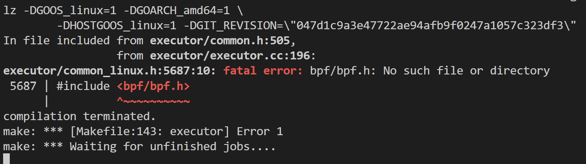
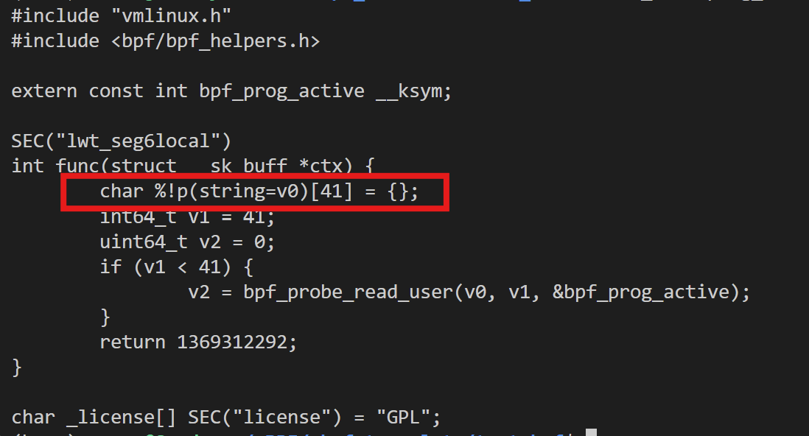
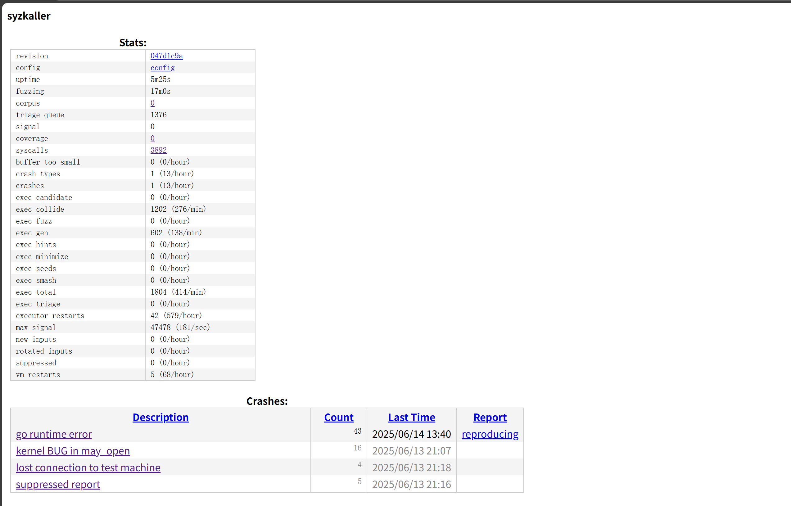

# BRF

## 简介

[BRF: Fuzzing the eBPF Runtime](https://dl.acm.org/doi/abs/10.1145/3643778) 是一个针对ebpf runtime组件的模糊测试工具。它旨在解决syzkaller对ebpf模糊测试低效的问题，从程序语义、程序依赖、程序执行三个要点出发，生成了有高verifier通过率、以及丰富语义（即包含了一些列helper与map操作）的C程序，并与syzkaller结合，对ebpf进行模糊测试，大大提升了代码覆盖率，并发现了6个新的ebpf漏洞。

仓库地址：https://github.com/trusslab/brf

## 环境搭建

### 基础复现流程

BRF仓库的README文件提供了详细的复现流程，可以直接按照这个流程走下来。不过在这个过程中，我仍然遇到了一些难以解决的问题。

### BRF编译问题

在make BRF源代码时，会产生报错：



这个错误产生的原因是libbpf组件没有被正确地配置，我为此提交了一个[PR](https://github.com/trusslab/brf/pull/49)，解决的办法也很简单，下载最新的libbpf并安装即可：

```
git clone https://github.com/libbpf/libbpf.git
cd libbpf/src
make
make install
make install_uapi_headers
```

### C代码编译问题

按照BRF的配置，生成器生成的ebpf C代码会在`$BRF_WORKDIR`下保存，并被挂载到Qemu中，使用clang-16进行编译，生成.o文件。但是实际运行过程中，我发现编译过程并没有被正确执行，可执行文件没有被生成，fuzz流程陷入停滞。

手动启动Qemu后，我尝试在虚拟机内用clang-16编译C文件：

```
qemu-system-x86_64 \
        -m 2G \
        -smp 2 \
        -kernel $KERNEL/arch/x86/boot/bzImage \
        -append "console=ttyS0 root=/dev/sda earlyprintk=serial net.ifnames=0" \
        -drive file=$IMAGE/bookworm.img,format=raw \
        -net user,host=10.0.2.10,hostfwd=tcp:127.0.0.1:10021-:22 \
        -net nic,model=e1000 \
	    -virtfs local,path=$KERNEL,mount_tag=host0,security_model=mapped,id=host0 \
        -virtfs local,path=$BRF_WORKDIR,mount_tag=brf,security_model=mapped,id=brf \
        -enable-kvm \
        -nographic \
        -pidfile vm.pid \
        2>&1 | tee vm.log

mkdir /mnt/brf_work_dir
mount -t 9p -o trans=virtio,version=9p2000.L brf /mnt/brf_work_dir


clang -g -O2 -D__TARGET_ARCH_x86 -I/usr/include/$(uname -m)-linux-gnu -Wno-compare-distinct-pointer-types -Wno-int-conversion -target bpf -mcpu=v3 -c ./prog_18488a70d6315a0e.c -o test.o

```

发现确实编译存在问题，似乎也是libbpf的配置问题，但是在前面的基础流程中明明已经安装了libbpf和头文件。不过为了解决这个问题，我还是尝试安装了`libbpf-dev`。

```
apt install libbpf-dev
```

成功解决了这个问题。

### C代码语法错误问题

我发现在生成的C文件中有一些匪夷所思的语法错误，在生成`char *`类型的变量时，正确的定义方式应该类似于`char v[8]=...`，但实际上变量的定义方式却是`char %!p(string=v)[8]=...`。



源码中关于这一部分代码的内容在 [prog/brf_legacy.go#L1308](https://github.com/trusslab/brf/blob/dev/prog/brf_legacy.go#L1308) 中：

```
	a.Name = fmt.Sprintf("v%d", p.VarId)
	a.Prepare = fmt.Sprintf("	char %p[%d] = {};\n", a.Name, varSize)
```

看起来也并没有什么不妥，为什么会生成这样语法的代码暂时未可知，我的解决办法简单粗暴，修改源代码，识别这样的错误语法并进行修正。

在 [prog/brf_prog.go](https://github.com/trusslab/brf/blob/dev/prog/brf_prog.go) 中，`writeCSource`函数会将生成好的C代码写入文件，我们只需在它写入文件之前将代码字符串改为正确的就可以。我添加了一个函数`fixCharError`，它使用正则表达式匹配错误代码，并修改为正确的格式：

```golang
import (
        "encoding/gob"
        "fmt"
        "os"
        "time"
        "regexp"
)

func fixCharError(content string) string {
        fmt.Printf("I am trying to fix this: %s",content)
        pattern := regexp.MustCompile(`%!p\(string=(\w+)\)\[(\d+)\]`)

        // 执行替换操作并返回结果
        newContent:=pattern.ReplaceAllString(content, "$1[$2]")
        fmt.Printf("I fix this: %s\n",newContent)
        return newContent
}

func (p *BpfProg) writeCSource() error {
        var progSrc string

        if (p.UseTestSrc) {
                progSrc = testSrc
        } else {
                progSrc = p.genCSource()
        }
        progSrc = fixCharError(progSrc)
        f, err := os.Create(p.BasePath + ".c")
        if err != nil {
                return err
        }
        defer f.Close()

        _, err = f.WriteString(progSrc)
        return err
}

```

### Qemu内存大小问题

解决了上述问题之后，按理来说，应该可以正常运行并编译生成可执行文件了，但是虚拟机仍然不断产生崩溃，观察了log之后，发现是虚拟机内存不够导致的，修改一下config文件就可以解决啦！把`mem`从`2048`修改为`4096`。

```
{
        "target": "linux/amd64",
        "http": "127.0.0.1:56741",
        "workdir": "$SYZKALLER/workdir/bookworm",
        "kernel_obj": "$KERNEL",
        "image": "$IMAGE/bookworm.img",
        "sshkey": "$IMAGE/bookworm.id_rsa",
        "syzkaller": "$SYZKALLER",
        "procs": 8,
        "type": "qemu",
        "vm": {
                "count": 4,
                "kernel": "$KERNEL/arch/x86/boot/bzImage",
                "cpu": 2,
                "mem": 4096,
		"brf_workdir": "$BRF_WORKDIR"
        }
}

```

## 运行效果

解决了上述问题以后，BRF可以正常跑起来了，在`$BRF_WORKDIR`目录下也可以看到正常的C代码以及可执行文件了，可喜可贺。

这里我使用的commit是 `047d1c9a3e47722ae94afb9f0247a1057c323df3` 。



不过相信聪明的你也已经发现了，**为什么coverage是0？**

这是因为在这一个 [commit](https://github.com/trusslab/brf/commit/047d1c9a3e47722ae94afb9f0247a1057c323df3) 中，WorkQueue loop相关的代码被注释掉了，`triageInput`函数不会被执行，也就不会收集覆盖率以及扩充语料库。

从commit的注释`"TEST: disable mutation"`似乎可以看出，这个提交只是为了测试brf生成程序以及执行的能力，那我们转移到上一个commit `a1f51c55c2c01b5959cfbfc9e44559da5d48551c` 再运行试试。