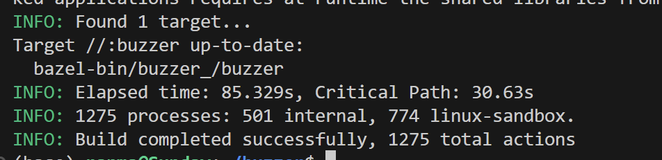
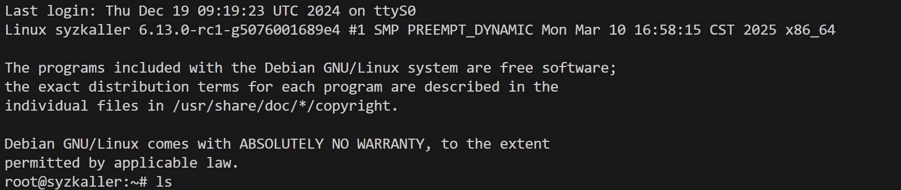
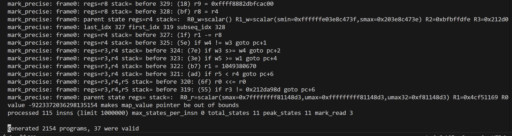
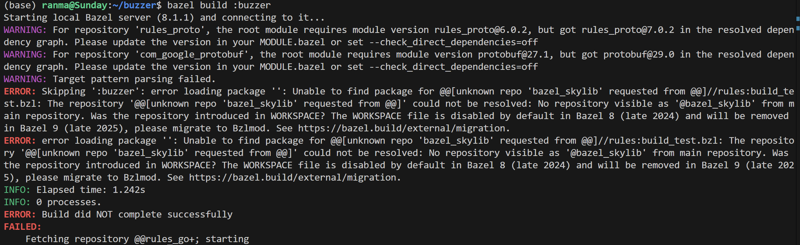
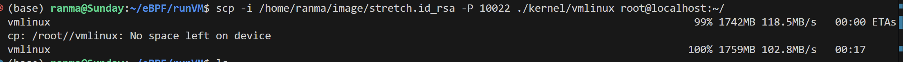
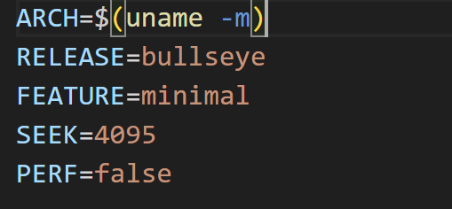

# Buzzer复现

## 1、环境搭建

### 1.1 依赖与工具

[bazel](https://bazel.build/install/ubuntu?hl=zh-cn)

clang安装 我使用的是llvm-10

```jsx
# bazel
sudo apt install apt-transport-https curl gnupg -y
curl -fsSL https://bazel.build/bazel-release.pub.gpg | gpg --dearmor >bazel-archive-keyring.gpg
sudo mv bazel-archive-keyring.gpg /usr/share/keyrings
echo "deb [arch=amd64 signed-by=/usr/share/keyrings/bazel-archive-keyring.gpg] https://storage.googleapis.com/bazel-apt stable jdk1.8" | sudo tee /etc/apt/sources.list.d/bazel.list

sudo apt update && sudo apt install bazel
sudo apt update && sudo apt full-upgrade
```

设置环境变量，设置clang和clang++的路径

```jsx
export CC=clang
export CXX=clang++
```

运行，使用bazel构建buzzer

```jsx
git clone https://github.com/google/buzzer.git
cd buzzer
bazel build :buzzer
```

build过程中可能会遭遇问题一，需要使用低版本的bazel才可顺利完成build



## 2、run Buzzer with coverage

[https://github.com/google/buzzer/blob/main/docs/guides/running_with_coverage.md](https://github.com/google/buzzer/blob/main/docs/guides/running_with_coverage.md)

### 2.1 准备

bullseye.img准备

linux kernel准备

注意：`CONFIG_BPF=y` and `CONFIG_BPF_SYSCALL=y`

### 2.2 qemu vm运行

```jsx
qemu-system-x86_64 \
        -m 20G \
        -smp 2 \
        -cpu host \
        -kernel PATH_TO_KERNEL_REPO/arch/x86/boot/bzImage \
        -append "console=ttyS0 root=/dev/sda nokaslr earlyprintk=serial net.ifnames=0" \
        -drive file=PATH_TO_DEBIAN_IMAGE/bullseye.img,format=raw \
        -net user,host=10.0.2.10,hostfwd=tcp:127.0.0.1:10022-:22,hostfwd=tcp:0.0.0.0:8080-:8080 \
        -net nic,model=e1000 \
        -enable-kvm \
        -nographic \
        -pidfile vm.pid \
        2>&1 | tee vm.log
        
# my cmd
qemu-system-x86_64 \
        -m 20G \
        -smp 2 \
        -cpu host \
        -kernel ./kernel/arch/x86/boot/bzImage \
        -append "console=ttyS0 root=/dev/sda nokaslr earlyprintk=serial net.ifnames=0" \
        -drive file=/home/ranma/image/stretch.img,format=raw \
        -net user,host=10.0.2.10,hostfwd=tcp:127.0.0.1:10022-:22,hostfwd=tcp:0.0.0.0:8080-:8080 \
        -net nic,model=e1000 \
        -enable-kvm \
        -nographic \
        -pidfile vm.pid \
        2>&1 | tee vm.log

```

运行成功：



### 2.3 材料准备

向vm中传输一些必要文件，以及必要的准备

```jsx
# 传输vmlinux
scp -i PATH_TO_DEBIAN_IMAGE/bullseye.id_rsa -P 10022 PATH_TO_KERNEL_REPO/vmlinux root@localhost:~/

# 创建目录
mkdir /root/sourceFiles

# 传输verifier.c文件
scp -i PATH_TO_DEBIAN_IMAGE/bullseye.id_rsa -P 10022 PATH_TO_KERNEL_REPO/kernel/bpf/verifier.c  root@localhost:~/sourceFiles

# 传输buzzer
scp -i PATH_TO_DEBIAN_IMAGE/bullseye.id_rsa -P 10022 PATH_TO_BUZZER  root@localhost:~/

# my cmd
scp -i ./image/bullseye.id_rsa -P 10022 ./kernel/vmlinux root@localhost:~/
scp -i ./image/bullseye.id_rsa -P 10022 ./kernel/kernel/bpf/verifier.c  root@localhost:~/sourceFiles
scp -i ./image/bullseye.id_rsa -P 10022 /home/ranma/eBPF/buzzer/bazel-bin/buzzer_/buzzer  root@localhost:~/

```

### 2.4 Buzzer运行

```jsx
./buzzer -strategy=pointer_arithmetic
# 直接运行./buzzer默认使用playground策略，没什么实际效果
```

运行效果：



## 报错

### 错误1



看上去似乎是bazel版本过高带来的问题，安装低版本的7.4.0 bazel即可解决

```jsx
sudo apt install bazel-7.4.0
sudo ln -s /usr/bin/bazel-7.4.0 /usr/bin/bazel
```

### 错误2

传输文件vmlinux遇到qemu空间不足



使用create-image.sh创建一个/root空间更大的image，修改SEEK参数，这里改为4G



### 错误3

运行./buzzer之后没有反应

[https://github.com/google/buzzer/issues/58](https://github.com/google/buzzer/issues/58)