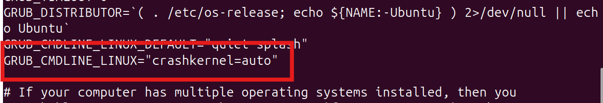

# Kdump在Linux环境下的配置

最近在交CNVD时用到了Kdump，用它来捕获系统崩溃后的崩溃信息，这里进行一个简单的记录。

## Kdump原理

Kdump使用了一种双内核的结构，主内核正常运行，但会预留一块区域保存crashkernel，另一个是捕获内核，当主内核崩溃时，它会进入预留的区域运行。另一种关键技术是Kexec，主内核崩溃时会通过Kexec立即跳转到捕获内核中，捕获内核随机运行，读取主内核中的旧数据，保存下崩溃现场，数据保存完毕以后重启。

## Kdump安装前的配置

**vmlinux安装** 安装Kdump之前，首先我们需要检查`/usr/lib/debug`下是否为空，如果为空我们需要下载带调试符号的内核镜像，Kdump的核心工具crash需要用它来分析生成的vmcore文件。可以用如下命令进行安装：

```shell
# GPG密钥导入
sudo apt-key adv --keyserver keyserver.ubuntu.com --recv-keys C8CAB6595FDFF622

codename=$(lsb_release -c | awk  '{print $2}')  
sudo tee /etc/apt/sources.list.d/ddebs.list << EOF  
deb http://ddebs.ubuntu.com/ ${codename}      main restricted universe multiverse  
deb http://ddebs.ubuntu.com/ ${codename}-security main restricted universe multiverse  
deb http://ddebs.ubuntu.com/ ${codename}-updates  main restricted universe multiverse  
deb http://ddebs.ubuntu.com/ ${codename}-proposed main restricted universe multiverse  
EOF

sudo apt-get update

sudo apt-get install linux-image-$(uname -r)-dbgsym

```

安装完成之后，`/usr/lib/debug`目录下就会出现带符号调试信息的内核：


**系统配置** 随后我们需要在系统启动时预留一部分内存给备用内核，修改`/etc/default/grub`，在`GRUB_CMDLINE_LINUX`中添加 `crashkernel=auto`（或指定大小如`crashkernel=256M`）。随后重启使其生效。



## Kdump安装与配置

Ubuntu中的安装指令如下：

```shell
sudo apt install linux-crashdump
```

安装的过程中应该会有弹窗，让我们配置kexec-tools或者kdump-tools，我们也可以手动配置：

```shell
sudo dpkg-reconfigure kexec-tools
sudo dpkg-reconfigure kdump-tools
```

配置成功后，可以运行如下命令查看状态：

```
kdump-config show
```


## Kdump测试

运行如下命令触发系统崩溃：

```shell
sudo sh -c "echo 1 > /proc/sys/kernel/sysrq"
sudo sh -c "echo c > /proc/sysrq-trigger"
```

系统崩溃重启以后可以在`/var/crash/`目录下看到崩溃转储的vmcore和dmesg信息：


## 参考

https://blog.csdn.net/Javachichi/article/details/139823714

https://blog.csdn.net/dwh0403/article/details/123551691