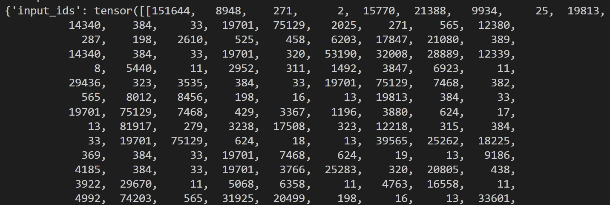
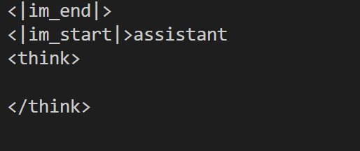
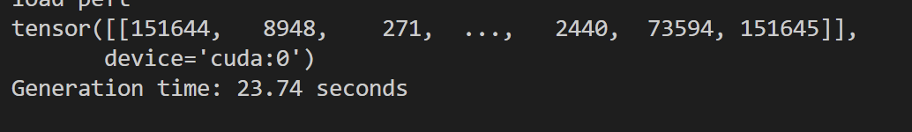

# 本地大模型调用
最近用Lora微调了一个小模型，生成一些小程序，记录一下我是怎么在本地部署使用的。

## 实验环境
A800 80G GPU
Qwen3 1.7b

## 使用模型进行推理
大模型部署好以后，怎么调用大模型进行推理工作呢？整个流程可以分为4步：

+ 初始化
+ 构建输入
+ 大模型生成
+ 解析输出
  
### 初始化
在这一步，我们将加载本地大模型和分词器，使用Hugging Face的`from_pretrained`函数。

```python
model = AutoModelForCausalLM.from_pretrained(
    "./Qwen", 
    device_map="auto",
    trust_remote_code=True,
)
tokenizer = AutoTokenizer.from_pretrained("./Qwen")
```

### 构建输入
在这一步，我们构建prompt作为输入，首先构造一个基础的消息文本。

```python
messages = [
    {"role": "system", "content": f"{prompt}"},
    {"role": "user", "content": f"{prompt_u}"}
]
```

然后用分词器构造template，将文字文本转化为大模型可以处理的输入格式。

```python
text = tokenizer.apply_chat_template(
    messages,
    tokenize=False,
    add_generation_prompt=True,
    enable_thinking=False
)

model_inputs = tokenizer([text], return_tensors="pt").to(device)
```

看看model_inputs直接打印出来输出的内容。



可以看到分词器将文字转化为了模型可理解的数字序列，每个数字对应分词器词汇表中的一个词/子词。

`tokenize=False`参数会让函数以文本的形式输出结果，否则将以id的形式输出结果。

`add_generation_prompt=True`会在输出的结果中增加一个assistant的操作，这里我们将text以文本的形式打印出来看看。


`enable_thinking`则是决定是否要启动大模型的思考模式，启动以后会延长思考时间，这里我直接关闭了。

### 使用模型进行推理
这一步，我们将上一步得到的输入传递给大模型进行推理，得到推理结果。

```python
generated_ids = model.generate(
    model_inputs.input_ids,
    max_new_tokens=MAX_LENGTH,
    temperature=1.0,
)
```

这里输出的generated_ids也是以id的形式展现的，要使用tokenizer将其转换为自认语言。



### 解析输出
这一步，我们将大模型的输出解码，转为自然语言。

```
generated_ids = [
    output_ids[len(input_ids):] for input_ids, output_ids in zip(model_inputs.input_ids, generated_ids)
]

response = tokenizer.batch_decode(generated_ids, skip_special_tokens=True)[0]
```


## 推理加速
跑着跑着，我就发现一些不对劲了，怎么生成速率这么慢？我统计了大模型进行10次推理任务所需的时间，生成一个1500 token长度的程序得花上**37s**，这对吗？

这不对，要知道我用的是个小模型，结果速度还不如网页大模型。

后面找到了一些加速的方法，请容我细细道来。

### 增大 batch size
简单来说就是在tokenizer中添加多个请求内容，让大模型同时处理，生成多个response。最大化GPU计算单元利用率​。这个过程很像**并发**。

### 使用多个GPU
这自然就没什么好说的。


## 完整程序代码

### 初始版本

```python
from transformers import AutoModelForCausalLM, AutoTokenizer, BitsAndBytesConfig
from peft import LoraConfig, get_peft_model, PeftModel
import torch
import random
import time


model = AutoModelForCausalLM.from_pretrained(
    "./Qwen", 
    device_map="auto",
    trust_remote_code=True,
)

peft_config = LoraConfig(
    task_type="CAUSAL_LM", inference_mode=False, r=8, lora_alpha=32, lora_dropout=0.1, target_modules=["q_proj", "v_proj"]
)


model = PeftModel.from_pretrained(model, "lora_adapter10-30")
print("load peft")


tokenizer = AutoTokenizer.from_pretrained("./Qwen")


prompt = "your system prompt"
prompt_u = "your user prompt"


MAX_LENGTH=1500

def predict(messages, model, tokenizer):
    device = "cuda"
    
    text = tokenizer.apply_chat_template(
        messages,
        tokenize=False,
        add_generation_prompt=True,
        enable_thinking=False
    )
    model_inputs = tokenizer([text], return_tensors="pt").to(device)
    attention_mask = torch.ones(model_inputs.input_ids.shape,dtype=torch.long,device="cuda")
    
    generated_ids = model.generate(
        model_inputs.input_ids,
        attention_mask=attention_mask,
        max_new_tokens=MAX_LENGTH,
        temperature=1.0,
    )

    generated_ids = [
        output_ids[len(input_ids):] for input_ids, output_ids in zip(model_inputs.input_ids, generated_ids)
    ]

    response = tokenizer.batch_decode(generated_ids, skip_special_tokens=True)[0]

    return response


save_dir="./seeds/"
total=0
for i in range(10):
    start_time=time.time()
    messages = [
        {"role": "system", "content": f"{prompt}"},
        {"role": "user", "content": f"{prompt_u.format(num=random.randint(5, 40))}"}
    ]

    response = predict(messages, model, tokenizer)
    end_time=time.time()
    total += end_time - start_time
    print(f"Generation time: {end_time - start_time:.2f} seconds")

    response_text = f"""

    LLM:{response}
    """

    print(response_text)
    file=f"{save_dir}seed_{i}.txt"
    with open(file, "w") as f:
        f.write(response)
        
print(f"average generation time: {total/10:.2f} seconds")


```


## 参考