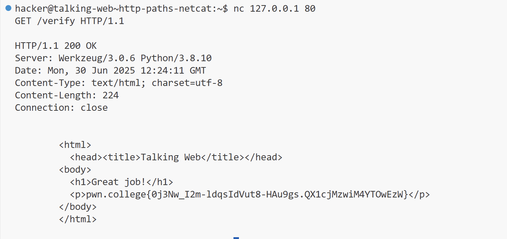

# PWN Web

我将在这里记录pwn.college中和web相关部分的练习。


## Playing With Programs - Talking Web

这一章节涉及到的是一些web相关的程序以及命令的基础用法，为后面进阶的内容打基础。

### level1 - level4

这部分内容比较简单，就跳过了。

### level5 - level6

这一关用到了`netcat`，也就是`nc`。netcat提供了一个和server交互的窗口用于构造请求。

首先连接server：`nc 127.0.0.1 80`，连接完成以后，按照如下格式构造请求：`GET / HTTP/1.1`。分别代表请求类型，路径，协议。随后netcat会自动构造完整的请求。

level6 同理，只不过多了一个/verify路径：`GET /verify HTTP/1.1` 。整个命令可以用一行表示 `echo -e "GET /verify HTTP/1.1\n" | nc 127.0.0.1 80`。



### level7

这一关使用 `curl` 构造请求：`curl 127.0.0.1:80/complete` 。

curl直接使用时，构造的是GET请求。加上--data时，构造的是POST请求。

### level8

这一关使用python写一个小脚本。

```python
#!/usr/bin/python
import requests

response=requests.get("http://127.0.0.1:80/challenge")
print(response.content)
```

### level9-level11

这几关需要设置特殊的header，指定header中的host。Host的作用是让server知道请求的是哪一个网站，因为一个IP可能对应多个域名，server需要指导用户请求的域名到底是哪一个。

level9 使用python。

```python
#!/usr/bin/python
import requests

header = {
    "Host":"webhacking.kr:80"
}

response=requests.get("http://127.0.0.1:80/submit", headers=header)
print(response.content)

```

level10 使用curl设置header Host。

```
curl -H "Host:net-force.nl:80" 127.0.0.1:80/task
```

level11 使用netcat设置请求头。

```
echo -e "GET /fulfill HTTP/1.1\nHost: 0xf.at:80\n\n" | nc 127.0.0.1 80
```

### level12

这一关提到了一个问题，就是**路径可能是包含空格的**，这种情况下使用nc构造请求时，要将路径中的空格用编码代替将其连接起来，否则会出现解析错误。

```
echo -e "GET /progress%20request%20qualify HTTP/1.1\nHost:challenge.localhost:80\n\n" | 
nc 127.0.0.1 80
```

### level13-15

这几关提到了parameter问题，即GET请求的参数问题。使用方式也很简单，在路径末尾使用 `?para=value` 即可。

level13：`curl -H "Host:challenge.localhost:80" http://127.0.0.1:80/gate?unlock=pwgklefy`

当然，参数可能是不只一个的，这种情况下用`&`将参数分隔开即可，**注意之间不要加空格**。

level14：

```
echo -e "GET /authenticate?secure_key=jcbaywzw&private_key=miwgzszt&access_code=buadbiky HTTP/1.1\nHost:challenge.localhost:80\n\n" | nc 127.0.0.1 80
```

level15：

注意这里需要将IP用双引号括起来，因为`&`在shell中有特殊的含义，会出现错误。

```
 curl -H "Host:challenge.localhost:80" "http://127.0.0.1:80/progress?keycode=wrgcvc
sy&security_token=zlptrsug&secret_key=eectkeks"
```

### level16-level22

这几关涉及到了POST请求的form填写。

level16很简单，在网页填个表格就可以了。

level17使用curl完成任务：`curl -H "Host:challenge.localhost:80" -d "pass=wrxfcbng" http://127.0.0.1:80/challenge`

level18使用netcat：

```
POST /pass HTTP/1.1
Host: challenge.localhost:80
Content-Type: application/x-www-form-urlencoded
Content-Length: 15

verify=kuzyuwlx
```


level19使用python：

```python
#!/usr/bin/python

import requests

header = {
    "Host":"challenge.localhost:80"
}

response=requests.post("http://127.0.0.1:80/fulfill", headers=header, data={"access_code":"dezevikr"})
print(response.content)

```

level20，这一个要求用firefox浏览器发送一个POST请求，不过其实仍然可以用python等工具完成这个任务，只用在User-Agent字段中加入Firefox就可以了。

```python
#!/usr/bin/python
import requests

header = {
    "Host":"challenge.localhost:80",
    "User-Agent":"Firefox"
}

response=requests.post("http://127.0.0.1:80/progress", headers=header, data={"secure_key":"cfezlwph"})
print(response.content)

```

level21 使用curl完成表格多内容的POST请求：

```
curl -H "Host:challenge.localhost:80" -d "hash=abnydllx" -d "unlock=hoskplkb" -d "auth_key=wknbddgj" http://127.0.0.1:80/check
```

对于多个form数据，用多个-d表示

level22 使用netcat完成多表格任务：

```
POST /validate HTTP/1.1
Host: challenge.localhost:80
Content-Type: application/x-www-form-urlencoded
Content-Length: 64

unlock_code=vbemwqtf&unlock=wxqdlpqz&pin=irdvpzgf&token=eiiddxbd
```

### level23-level25

URL 重定向（也称为 URL 转发）是一种为页面、表单或者整个 Web 站点/应用提供多个 URL 地址的技术。HTTP 对此操作有一种特殊类型的响应，称为 HTTP 重定向（HTTP redirect）。

level23使用netcat处理重定向：

```
GET / HTTP/1.1
Host: challenge.localhost:80

GET /uVbqQpyn-fulfill HTTP/1.1
Host: challenge.localhost:80
```

level24，使用curl进行处理，curl的-L选项，可以自动处理重定位问题：

```
curl -L -H "Host:challenge.localhost:80" http://127.0.0.1:80/
```

level25，使用python就更简单了，requests库会自动处理redirect的情况：

```python
#!/usr/bin/python
import requests

header = {
    "Host":"challenge.localhost:80",
}

response=requests.get("http://127.0.0.1:80/", headers=header)
print(response.content)
```

### level26-level28

这几关加入了cookie。

level26:

curl的-c可以将cookie保存到一个文件，-b则是指定文件内容作为cookie。

```
curl -c cookies.txt 127.0.0.1
curl -b cookies.txt 127.0.0.1
```

level27:

```
nc 127.0.0.1 80

GET / HTTP/1.1
Cookie: cookie=xxx
```

level28:

```python
#!/usr/bin/python
import requests

header = {
    "Cookie": "cookie=x"

}

response=requests.get("http://127.0.0.1:80/", headers=header)
print(response.content)
```

### level29-level36

level29，这一关使用python requests完成，requests似乎也有针对state的功能，所以代码很简单，仅用requests发送请求即可。

```python
#!/usr/bin/python
import requests

response=requests.get("http://127.0.0.1:80/")
print(response.content)
```

level30，这一关要求我们对1337端口进行监听，运行/challenge/client客户端以后，会发送带有flag的请求。

```
nc -l 1337
```

level31，在server端进行一个重定向。

```
import flask
import os

app = flask.Flask(__name__)

@app.route("/", methods=["GET"])
def redirector():
    return flask.redirect(f"http://challenge.localhost:80/attempt")

app.secret_key = os.urandom(8)
app.run("localhost", 1337)
```

## Web Security - Intro to Cybersecurity

### Path Traversal 1-2

这两关与路径相关，我们在request中加入`../`即可挣脱出server设置的路径限制，对任意其他文件进行访问。

level1: `curl  http://challenge.localhost:80/blob/..%2F..%2Fflag`

如果我们直接运行`curl  http://challenge.localhost:80/blob/../../flag`，路径最终会被解析为`/flag`，会出现这个问题的原因是**curl会对路径进行简化**，将`../`合并，因此我们可以通过将字符转为编码以解决此问题。此外，我们也可以用curl的flag `--path-as-is` 解决此问题，即使用命令 `curl --path-as-is http://challenge.localhost:80/blob/../../flag`。

level2：`curl -v http://challenge.localhost:80/data/fortunes/..%2F..%2F..%2Fflag`

从level2的server源码`requested_path = app.root_path + "/files/" + path.strip("/.")`可以观察到，相较于level1，level2将path首尾的 `.` 和 `\` 字符删去了，我们只需要在路径首部加上一个存在的文件夹即可绕过。根据观察，在/challenge/files路径下存在一个fortunes文件夹，我们可以借此绕过检查。

### CMDi 1-6