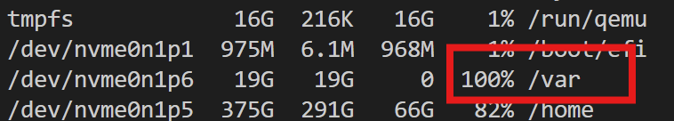
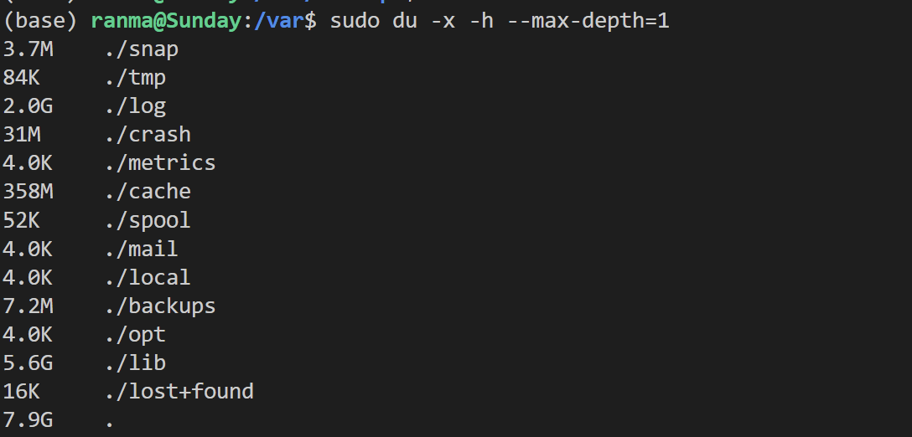
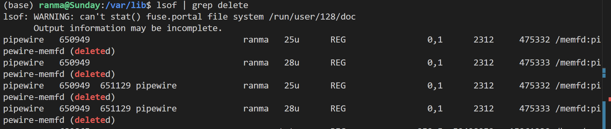
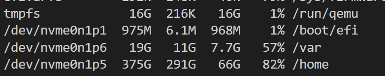

# 清理var目录

## 清理过程

今天运行我的主机的时候突然提示var目录占满了，使用`df -h`查看，19G空间都被占满了。

随机我准备对var目录进行清理，到目录下查看存储量占用时，却发现当前的文件根本没有占用那么多空间。

按理来说还有十几G的空间才对。

查阅资料发现当进程打开了某个文件时，只要该进程保持打开该文件，即使将其删除，它依然存在于磁盘中。这意味着，进程并不知道文件已经被删除，它仍然可以向打开该文件时提供给它的文件描述符进行读取和写入。这个文件仅对该进程可见，对其他进程不可见，**因为已经删除了其相应的目录索引节点**。这也就是存在着幽灵文件占用`/var`目录磁盘空间的原因。

我使用命令`lsof | grep delete`查看是否有进程在占用已经删除了的文件，发现果然如此。

将这些进程`kill`之后，磁盘空间果然得到了释放。

## 参考

https://blog.csdn.net/ithomer/article/details/8649706